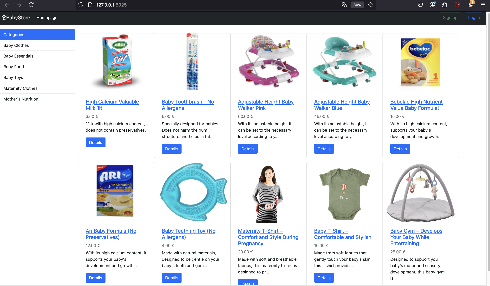
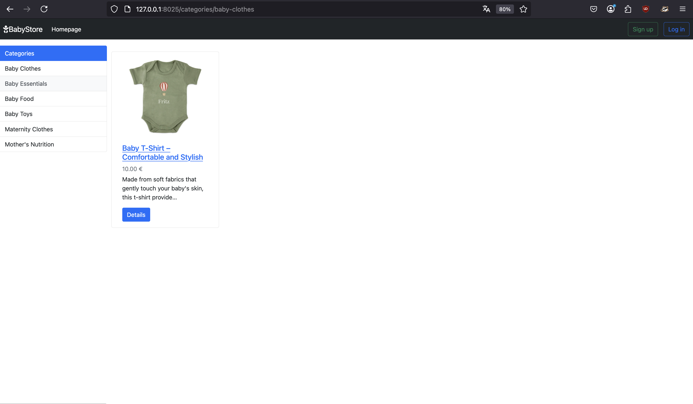
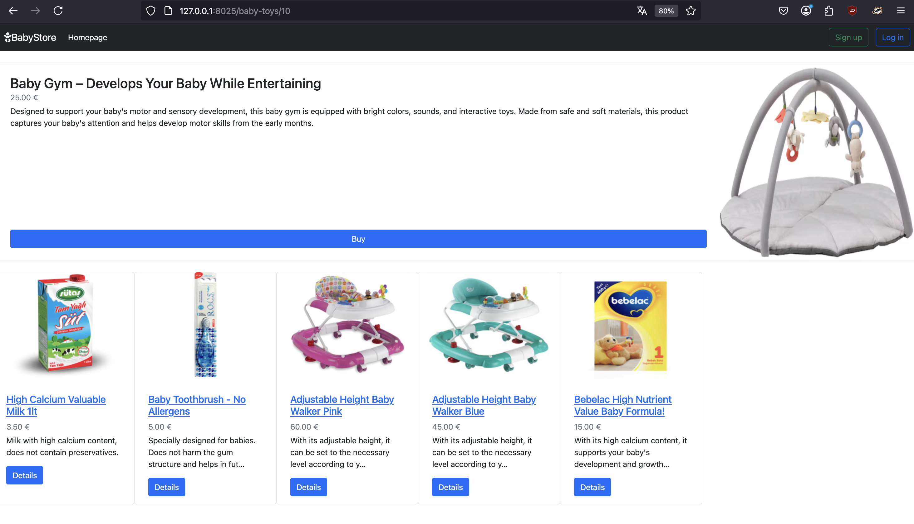
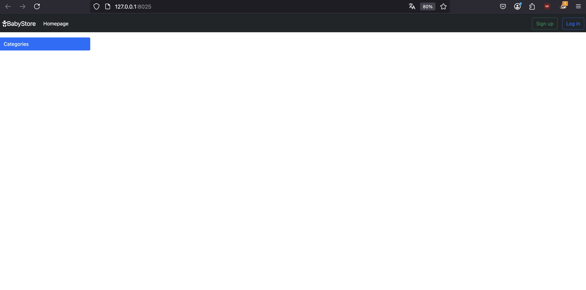
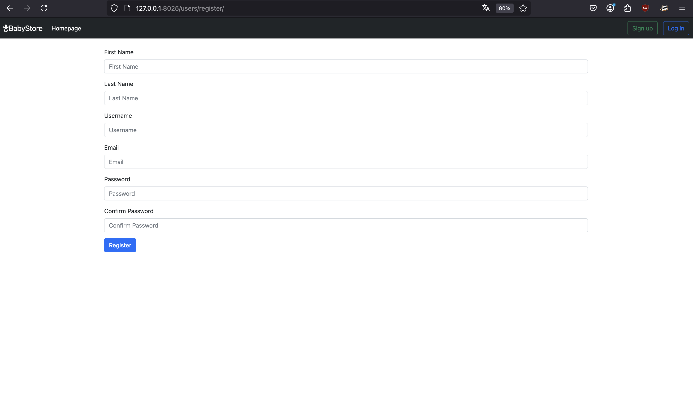
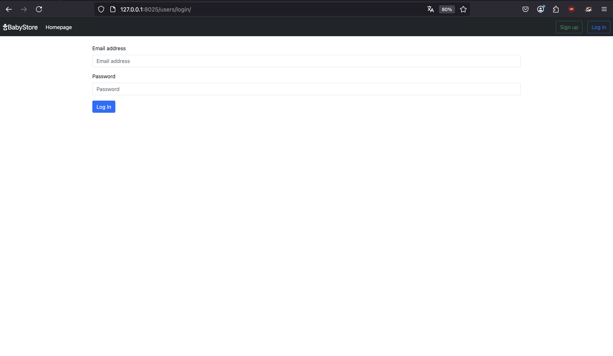

# E-Commerce Project For Baby Tools

This repository contains the code for an e-coomerce platform built with Django and Python for selling baby tools. It has features like products catalog, user registration and an admin panel.
The project is containerized using Docker.

## Table of Contents

1. [Quickstart](#quickstart)
2. [Technologies](#technologies)
3. [Hints](#hints)
4. [Additional Informations](#additional-informations)
5. [Screenshots](#screenshots)

## Quickstart

To quickly get hands on this project, follow these steps:

### Step 1: Docker

Make sure that Docker is insalled by running:

```bash
$ docker --version
```
If not installed, follow the instructions at the [official Docker site](https://docs.docker.com/desktop/).

### Step 2: Build the Docker image

With Docker installed, move into the folder containing the `Dockerfile` and run following command:

```bash
$ docker build -t baby_tools_shop:demo -f Dockerfile .

# `-t` specifies the build image and eventually a tag <name_image>:<tag>
# `-f` specifies which Dockerfile to use
# `.`  the dot indicates the current directory as the directory 
#      that containes all the files needed for the docker image
```

### Step 3: Run the Docker container

Once the image is built successfully, run it:

```bash
$ docker run -it --rm -p 8025:8025 baby_tools_shop:demo

# `-it`  runs the container in interactive mode with a terminal
# `--rm` removes the container automatically after stopped
# `-p`   maps the chosen port inside the container to the chosen port on your local machine 
#        following this syntax <local_machine_port>:<container_port>
```
If the command is successful, the container is now running and the app within is accessible by navigating to [`http://localhost:8025`](http://localhost:8025) or [`http://127.0.0.1:8025`](http://127.0.0.1:8025)

> [!NOTE]
> First time testing this app, the categories and products are gonna be [empty](#home-page-with-no-categories-and-products-empty-database). In order to be able to add those, create a [superuser](https://docs.djangoproject.com/en/5.2/topics/auth/default/#:~:text=createsuperuser%20command%3A) in Django, navigate to [`http://localhost:8025/admin`](http://localhost:8025/admin), login as such and add them manually as you like.


> [!CAUTION]
> If you're running this on a remote server, there are more tweaks to apply, especially what concerns [security](#additional-informations) and sensible data.  
> For quick testing purposes you can:
> - either add (before building the image) your server's IP address to `ALLOWED_HOST` in `settings.py` (to avoid `Invalid HTTP_HOST header` errors) 
> - or manage it with [environment variables](#hints)
>
> Afterwards you should be able to visit the app at `http://<server_ip_address>:8025`.


## Technologies

- Python 3.9
- Django 4.0.2
- Docker

## Hints

This section will cover some useful tips when trying to interacting with this repository:

- Settings & Configuration for Django can be found in [`babyshop_app/babyshop/settings.py`](./babyshop_app/babyshop/settings.py)
- Routing informations, such as available routes, can be found under any `urls.py` file in `babyshop_app` and corresponding subdirectories
- On startup, the container applies migrations automatically and starts the Django development server on port 8025
- All the required libraries are listed in [`requirements.txt`](./requirements.txt)
- Docker build instructions are defined in the [`Dockerfile`](./Dockerfile)
- Excluding files from the Docker image is done with a .dockerignore file (similar to a .gitignore)
- `Environment variables` can be put in a `.env` file and can be referred to it while running the container, for ex.:
    ```bash
    $ docker run --env-file .env -it --rm -p 8025:8025 baby_tools_shop:demo
    ```
- For local testing with Django, before creating a container, a python `venv` proves useful (optionally `pyenv` for managing multiple Python versions)

## Docker useful commands

Here is a couple of useful Docker terminal commands:
```bash
$ docker images
# shows all the built docker images

$ docker ps -a 
# shows all containers (running and not)

$ docker exec -it <container_name_or_id> /bin/bash
# opens a shell in a running container

$ docker stop <container_name_or_id>
# stops the indicated running container 

$ docker logs -f <container_name_or_id>
# shows real time logs of the indicated running container
```
> [!NOTE]
> Image name and Container name are different:   
> - **Image name** is specified with the command `docker build` and refers to the Docker image that functions as a blueprint for creating and running containers. 
> - **Container name** is the name automatically given from Docker to a running instance of the image. This name differs from the image name but can be specified manually through `--name <chosen_container_name>`, for example:
>   ```bash
>   $ docker run --name baby_shop_container -it --rm -p 8025:8025 baby_tools_shop:demo
>   ```

## Additional informations

- This project uses Django development server, which is not recommended for production.
- For more detailed informations about configurations, security, and settings for Django, please refer to the official [Django documentation](https://docs.djangoproject.com/en/5.2/).

## Screenshots

#### Home Page 



#### Home Page with filters



#### Product Details Page



#### Home Page with no categories and products (empty database)



#### Sign up Page



#### Login Page


